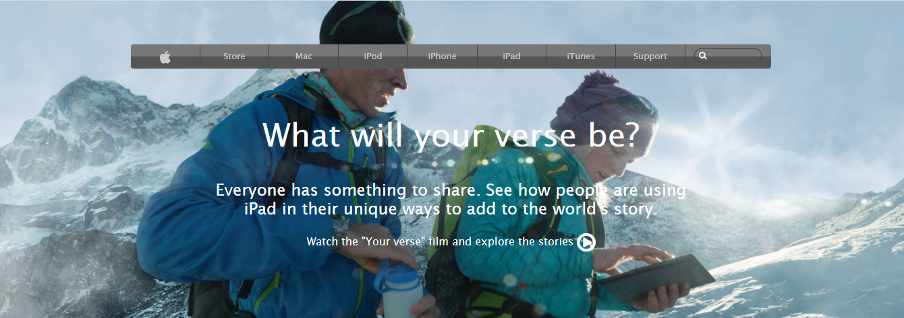

# A clone of an old version [Apple.com](https://web.archive.org/web/20140301004610/http://www.apple.com/) Page.

This project consists of building a webpage using images as a background and adding gradients to elements. The goal is to make a clone of old an old version of the [Apple](https://web.archive.org/web/20140301004610/http://www.apple.com/) website webpage.

## Built With
- HTML5
- CSS3
- Font Awesome 4 Icons
- SVG sources, images links in the original web page

## Live Demo

[Live Demo Link](https://raw.githack.com/CornerstoneII/Building-with-Backgrounds-and-Gradients/master/index.html)

## Getting Started

**To get your own copy of our project clone the repository to your local machine.**

## Authors

👤 **Bello Babakolo**

- Github: [@belsman](https://github.com/belsman)
- Twitter: [@d_belsman](https://twitter.com/d_belsman)
- Linkedin: [Bello Babakolo](https://linkedin.com/bello-babakolo-b23b17145)

👤 **Oluwaseun Iyadi**

- Github: [@CornerstoneII](https://github.com/CornerstoneII)
- Twitter: [@It_Iz_I](https://twitter.com/It_Iz_I)
- Linkedin: [Oluwaseun Iyadi](https://www.linkedin.com/in/oluwaseun-iyadi-773584b4/)

## 🤝 Contributing

Contributions, issues and feature requests are welcome!

Feel free to check the [issues page](issues/).

## Show your support

Give a ⭐️ if you like this project!

## 📝 License

This project is [MIT](lic.url) licensed.
